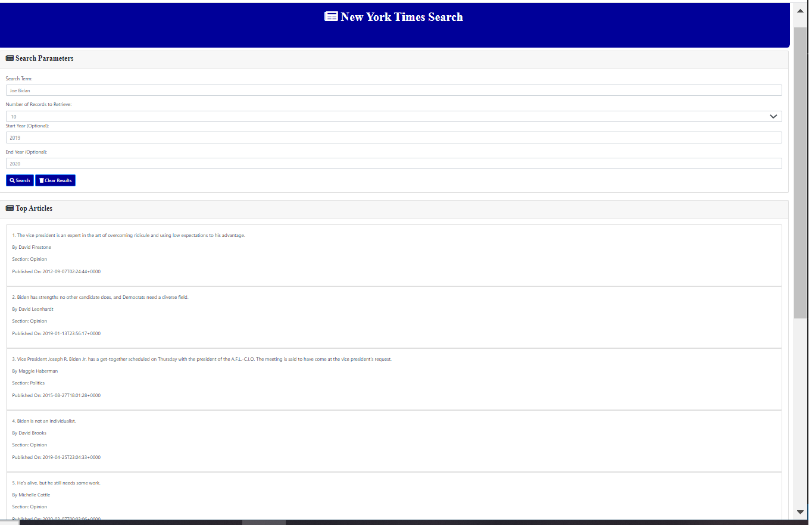

# NYTimes Search

## Description
This is a project developed to serach for articles using NYTimes API using javascript and HTML5. The page is responsive and uses bootstrap CSS framework
## Table of Contents
* [Installation](#installation)
* [Usage](#usage)
* [License](#license)
* [Questions](#questions)
## Installation
This serach application is located at GitHub at https://github.com/vkalaparthy/NYTimes-search and the application can be from https://vkalaparthy.github.io/NYTimes-search/
## Usage
Provide the search parameters and the Top articles for the provided search parameters will be displayed in section that says Top Articles.

## License
Copyright © 2020-present, Vani Kalaparthy. Released under the MIT License.

## Questions
* Vani Kalaparthy
  * https://github.com/vkalaparthy
  * kalaparthy.vani@gmail.com
